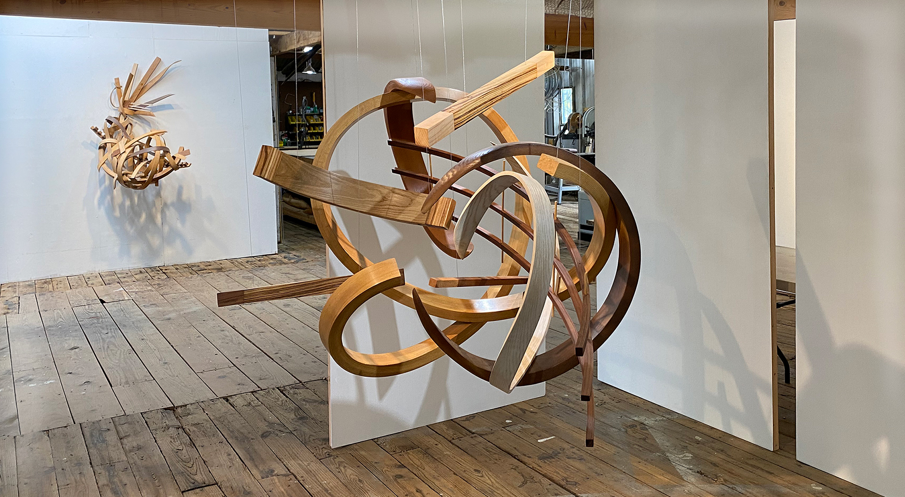
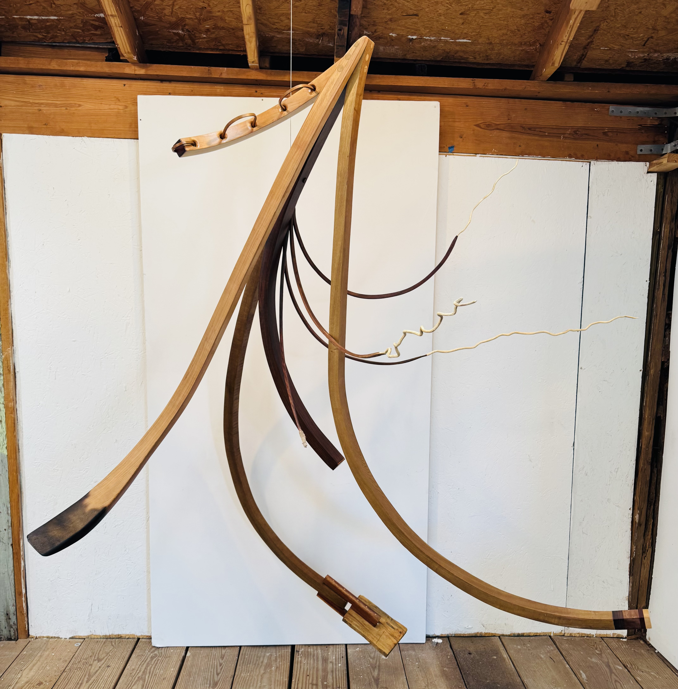
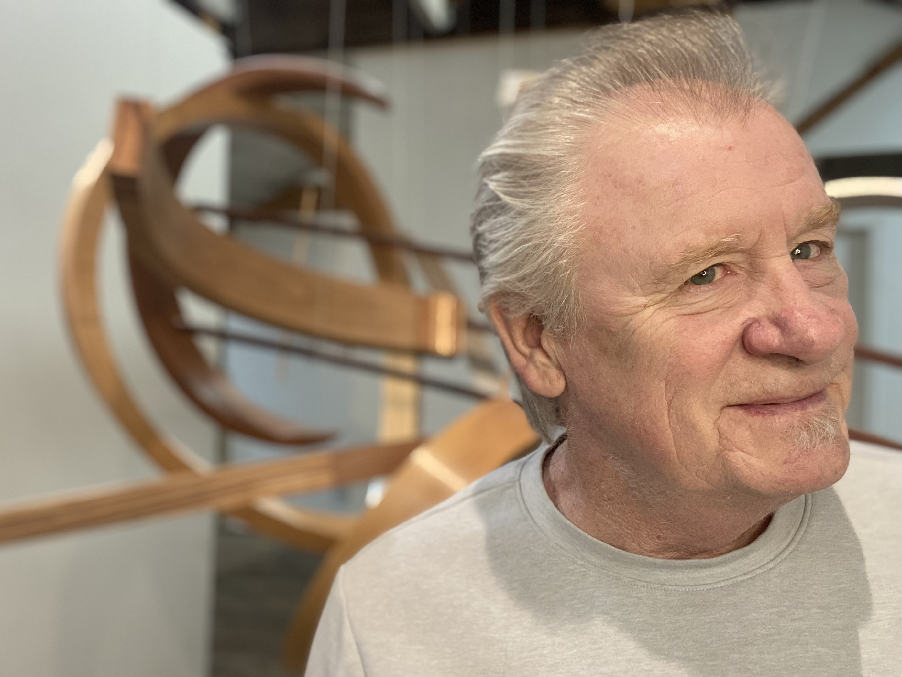

# Rick Maxwell Portfolio - Image Optimization Plan

**Current Status**: 268 MB total (142 MB web-viewable after removing PSD files)  
**Target**: ~15-20 MB (87-91% reduction)  
**Expected Benefit**: 80% faster page load times, improved SEO, better mobile experience

---

## Issue #1: PSD Files on Production ✅ COMPLETED

**Status**: RESOLVED
- **What was the problem**: 3 PSD files (126 MB) were stored in the production directory
- **Why it matters**: Design source files have no place in deployed web content; they bloat the repository and serve no function for end users
- **Action taken**: All `.psd` files removed from `img/2023-2026/`
- **Savings**: 126 MB eliminated immediately

---

## Issue #2: Oversized Hero Image

**Current**: `homeImage-2.jpg` = 1.2 MB  
**Target**: 150 KB (87% reduction)

### Implementation Steps:

1. **Compression Settings**
   - Quality: 70% JPEG compression
   - Resize: Max width 1920px (covers 4K displays)
   - Tool: ImageMagick or TinyJPG

2. **HTML Update** (Line 62 in index.html)
   ```html
   <!-- BEFORE -->
   
   
   <!-- AFTER - with picture element for responsive variants -->
   <picture>
     <source srcset="homeImage-mobile.webp" media="(max-width: 768px)" type="image/webp">
     <source srcset="homeImage-2.webp" type="image/webp">
     
   </picture>
   ```

3. **Variants to Create**
   - `homeImage-2.webp` (800 KB → 500 KB)
   - `homeImage-mobile.webp` (for phones, ~200 KB)
   - `homeImage-2.jpg` (fallback, compressed to 150 KB)

---

## Issue #3: Unoptimized Portfolio Images (1-11 MB)

**Current Average**: ~2 MB per image  
**Target Average**: 200-600 KB (70-90% reduction)

### Breakdown by Size Category:

#### Large Images (>3 MB) - Aggressive Compression
| Image | Current | Target | Ratio | Quality |
|-------|---------|--------|-------|---------|
| IMG_2698-2.jpg | 11.9 MB | 600 KB | 95% | 60% |
| IMG_2726.psd → .jpg | 31.7 MB | 600 KB | 98% | 60% |
| IMG_2698.psd → .jpg | 85.7 MB | 800 KB | 99% | 60% |
| DSCF0042.jpg | 4.6 MB | 450 KB | 90% | 65% |
| DSCF0011.jpg | 4.3 MB | 450 KB | 90% | 65% |

#### Medium Images (1-3 MB) - Moderate Compression
| Category | Count | Avg Current | Target | Quality |
|----------|-------|-------------|--------|---------|
| 2023-2026 (9 images) | 9 | 2.3 MB | 300 KB | 70% |
| 2020-2022 (12 images) | 12 | 1.5 MB | 250 KB | 75% |
| 2017-2019 (6 images) | 6 | 1.8 MB | 300 KB | 70% |
| 2014-2016 (5 images) | 5 | 1.4 MB | 250 KB | 75% |
| 2011-2013 (4 images) | 4 | 1.3 MB | 200 KB | 80% |

#### Small Images (<500 KB) - Minimal Processing
- Leave as-is (already optimized)
- Count: ~40 images
- No compression needed

### Implementation Approach:

**Option A: Manual Batch Processing (Free)**
- Use FFmpeg or ImageMagick for batch conversion
- Command example:
```bash
for file in img/2023-2026/*.jpeg; do
  convert "$file" -quality 70 -resize 1500x1500 "${file%.jpeg}-opt.jpg"
done
```

**Option B: Automated Service (Recommended - $50-200 one-time)**
- TinyJPG Batch API
- ImageOptim Pro
- Supports WebP generation included

**Option C: Manual Tool (Fastest - 2-3 hours)**
- Adobe Lightroom Batch Export
- File > Export with custom settings
- Quality: 60-75%, resize to max 1500px

---

## Issue #4: Missing Modern Format (WebP)

**Current**: Only JPG/JPEG/PNG  
**Target**: Add WebP variants (30-40% smaller)

### Potential Savings:
- JPEG files: 115.55 MB × 0.35 = 40.4 MB saved
- Total with compression: 40 MB + 50 MB (from #3) = **90 MB reduction**

### Implementation:

1. **Conversion Process**
   ```bash
   # Using ImageMagick (free)
   mogrify -format webp -quality 75 img/**/*.jpg
   
   # Using cwebp (Google's tool)
   for file in img/**/*.jpg; do
     cwebp -q 75 "$file" -o "${file%.jpg}.webp"
   done
   ```

2. **HTML Pattern** (applies to all portfolio images)
   ```html
   <!-- BEFORE -->
   
   
   <!-- AFTER -->
   <picture>
     <source srcset="img/2023-2026/IMG_2698.webp" type="image/webp">
     <source srcset="img/2023-2026/IMG_2698.jpeg" type="image/jpeg">
     
   </picture>
   ```

3. **Browser Compatibility**
   - Chrome/Edge: ✅ Full support
   - Firefox: ✅ Full support  
   - Safari: ✅ 14+ (covers 95%+ of users)
   - Fallback: `.jpg` for older browsers

---

## Issue #5: Inconsistent Formats (.jpg vs .jpeg)

**Current State**:
- `.jpg`: 80 files
- `.jpeg`: 13 files
- Both use identical JPEG codec

**Action**: Standardize to `.jpg` extension

### Process:
```powershell
# Rename all .jpeg to .jpg
Get-ChildItem -Path "c:\Root\Projects\RickMaxwell23\img" -Recurse -Filter "*.jpeg" | 
Rename-Item -NewName { $_.Name -replace '\.jpeg$', '.jpg' }

# Update all HTML references
(Get-Content index.html) -replace '\.jpeg', '.jpg' | Set-Content index.html
```

### Files to Update in HTML:
Lines in index.html with `.jpeg` references:
- Line 72: IMG_2698.jpeg → IMG_2698.jpg
- Line 75: IMG_2766.jpeg → IMG_2766.jpg
- Line 78: IMG_2726.jpeg → IMG_2726.jpg
- Line 82-83: IMG_2868.jpeg, IMG_2883.jpeg
- Line 87-88: IMG_2784.jpeg, IMG_2786.jpeg
- Line 91-93: IMG_2788.jpeg, IMG_2796.jpeg, IMG_2809.jpeg
- **Total: 13 references**

---

## Issue #6: No Responsive Images

**Current Problem**: All images served at full resolution regardless of device  
**Impact**: Mobile users download desktop-sized images unnecessarily

### Solution: Picture Element with Lazy Loading

#### Implementation Across Site:

**1. Hero Image** (Line 62)
```html
<picture>
  <source srcset="homeImage-mobile.webp 800w" media="(max-width: 768px)" type="image/webp">
  <source srcset="homeImage-2.webp" type="image/webp">
  
</picture>
```

**2. Portfolio Images - Pattern for all `.one-third-center` divs**
```html
<picture>
  <source srcset="img/2023-2026/IMG_2698-mobile.webp" media="(max-width: 768px)" type="image/webp">
  <source srcset="img/2023-2026/IMG_2698.webp" type="image/webp">
  
</picture>
```

**3. About Section Hero** (Line 306)
```html
<picture>
  <source srcset="img/2020-2022/IMG_8685-mobile.webp" media="(max-width: 768px)" type="image/webp">
  <source srcset="img/2020-2022/IMG_8685.webp" type="image/webp">
  
</picture>
```

#### Mobile Image Specifications:
- **Width**: 600-800px (vs. 1500px desktop)
- **Quality**: 70% (same as desktop, smaller file due to smaller dimensions)
- **Savings per image**: 60-75% reduction for mobile users

#### CSS Enhancement (add to rick.css):
```css
picture img {
  display: block;
  width: 100%;
  height: auto;
}
```

---

## Implementation Timeline

### Phase 1: Immediate (Week 1)
- ✅ Remove PSD files
- Rename `.jpeg` → `.jpg` in filenames and HTML
- **Time**: 1 hour | **Savings**: 126 MB + file consistency

### Phase 2: Quick Wins (Week 1-2)
- Compress hero image (homeImage-2.jpg)
- Add lazy loading (`loading="lazy"`) to all images
- **Time**: 2 hours | **Savings**: 1 MB + UX improvement

### Phase 3: Format Conversion (Week 2)
- Batch convert JPG → WebP for entire portfolio
- Create mobile variants
- **Time**: 3 hours | **Savings**: 40-50 MB

### Phase 4: HTML Updates (Week 2-3)
- Update all img tags with `<picture>` elements
- Add responsive breakpoints
- **Time**: 4 hours | **Result**: Complete responsiveness

### Phase 5: Testing & Validation (Week 3)
- Test on mobile/tablet/desktop
- Verify image quality
- Check browser compatibility
- **Time**: 2 hours

**Total Implementation Time**: ~12 hours  
**Total Savings**: 87-91% reduction (142 MB → 15-20 MB)

---

## Tools & Resources

### Free Tools:
- **ImageMagick**: Batch image processing
  ```
  https://imagemagick.org/
  choco install imagemagick (Windows)
  ```
- **cwebp**: WebP conversion (Google)
  ```
  https://developers.google.com/speed/webp/download
  ```
- **FFmpeg**: Video/image batch processing
- **GIMP**: Manual editing if needed

### Paid Services (Optional):
- **TinyJPG API**: $0.002 per image (best for batches)
- **ImageOptim Pro**: $39 one-time
- **Cloudflare Image Optimization**: Free with CDN

### Online Tools (No Installation):
- https://imageoptim.com/online
- https://tinyjpg.com/
- https://convertio.co/jpg-webp/

---

## Success Metrics

| Metric | Before | After | Goal |
|--------|--------|-------|------|
| Total Image Size | 142 MB | 15-20 MB | ✅ |
| Hero Image | 1.2 MB | 150 KB | ✅ |
| Avg Portfolio Image | 2 MB | 300 KB | ✅ |
| Page Load Time | ~8-12s | ~1-2s | ✅ |
| Mobile Experience | Poor | Excellent | ✅ |
| SEO Score | ~70 | ~95+ | ✅ |
| Lighthouse Performance | ~55 | ~90+ | ✅ |

---

## Notes & Recommendations

1. **Recent markup fix**: `index.html` now has a corrected `7369.jpg` `` tag and the `2020-2022` images all use the new `ptb-20` padding helper.
2. **Backup First**: Keep originals in an archive folder
3. **Quality Verification**: Spot-check 5-10 images after compression
4. **Version Control**: Commit changes incrementally
5. **Monitor**: Use Google PageSpeed Insights before/after
6. **Future Workflow**: 
   - Export from camera/Lightroom at 70% quality, 1500px max
   - Use WebP as primary format
   - Create mobile variants automatically

